

# <b>Laporan Pertemuan 6 - Kuis 1</b>
<b> Nama: Elang Putra Adam

Kelas: TI 3G

NIM: 2141720074 </b>

# <b>Pertanyaan dan Jawaban</b>

<b>1. Tugas 1</b>

<b>Jawab:</b>

a. Kode Program

    void main() {
        // Tugas 1
        print('Hello world!');
    }

b. Hasil

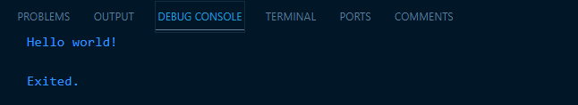

c. Penjelasan

Kode diatas digunakan untuk menampilkan "Hello world!" dengan menggunakan fungsi print() yang nantinya isi dari fungsi tersebut akan ditampilkan sebagai hasil output.

<b>2. Tugas 2</b>

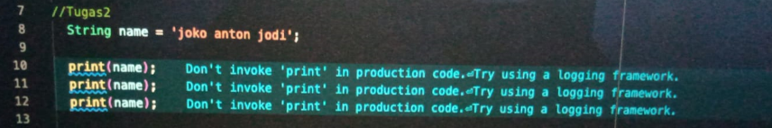

<b>Jawab:</b>

a. Kode Program

    void main() {
        // Tugas 2
        String name = 'Elang Putra Adam';

        print(name);
        print(name);
        print(name);
    }

b. Hasil

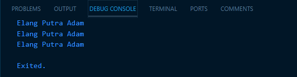

c. Penjelasan

Kode diatas digunakan untuk melakukan print() pada variabel name yang bertipe String dengan isi "Elang Putra Adam" (diubah sesuai dengan nama mhs) yang nantinya akan ditampilkan sebagai hasil output.

<b>3. Tugas 3</b>

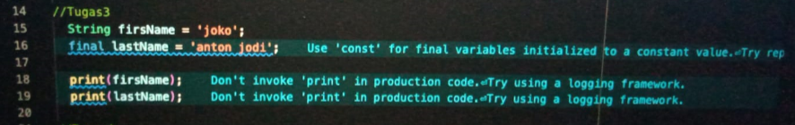

<b>Jawab:</b>

a. Kode Program

    void main() {
        // Tugas 3
        String firstName = "Elang";
        final lastName = "Putra Adam";

        print(firstName);
        print(lastName);
    }

b. Hasil

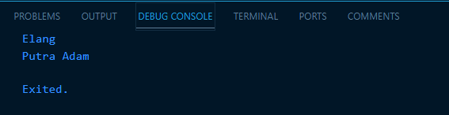

c. Penjelasan

Kode diatas digunakan untuk menampilkan variabel firstName (Elang) dengan tipe data String dan variabel lastName (Putra Adam) dengan tipe data final sebagai hasil output yang menghasilkan tampilan seperti pada gambar diatas.

> **_Note:_**  Variabel final merupakan sebuah variabel statis yang nilainya tidak bisa diubah.

<b>4. Tugas 4-a</b>

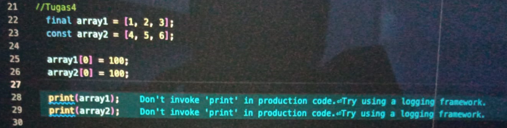

<b>Jawab:</b>

a. Kode Program

    void main() {
        // Tugas 4-a
        final array1 = [1, 2, 3];
        final array2 = [4, 5, 6];

        array1[0] = 100;
        array2[0] = 100;

        print(array1);
        print(array2);
    }

b. Hasil

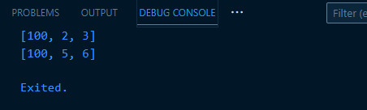

c. Penjelasan

Kode diatas melakukan pembuatan 2 buah array (array1 dan array2) yang memiliki nilainya masing-masing. Pada baris kode array1[0] = 100; dan array2[0] = 100;, dilakukan sebuah proses perubahan nilai array yang awalnya pada array1 index 0 nilainya adalah 1, diubah menjadi 100 dan array2 index 0 yang nilai awalnya adalah 4 diubah menjadi 100 sehingga menghasilkan output seperti pada gambar diatas.

<b>5. Tugas 4-b</b>

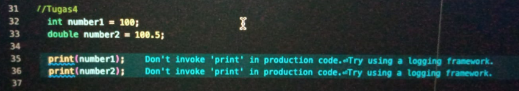

<b>Jawab:</b>

a. Kode Program

    void main() {
        // Tugas 4-b
        int number1 = 100;
        double number2 = 100.5;

        print(number1);
        print(number2);
    }

b. Hasil

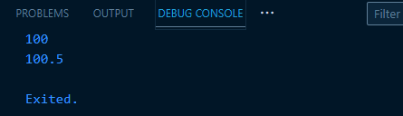

c. Penjelasan

Kode diatas membuat sebuah variabel yang bertipe integer(number1) yang memiliki nilai 100 dan sebuah variabel bertipe double (number2) yang memiliki nilai 100.5. Setelah itu dilakukan proses print sehingga menampilkan hasil seperti pada gambar diatas.

> **_Note:_**  Variabel number2 dengan tipe data double dapat menampung nilai yang bernilai desimal (bilangan berkoma).

<b>6. Tugas 5</b>

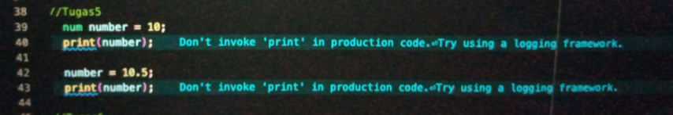

<b>Jawab:</b>

a. Kode Program

    void main() {
        // Tugas 5
        num number = 10;
        print(number);

        number = 10.5;
        print(number);
    }

b. Hasil

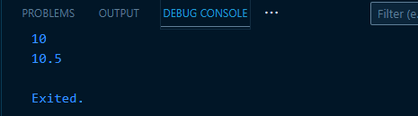

c. Penjelasan

kode diatas membuat sebuah variabel number dengan tipe num yang memiliki nilai awal 10 lalu dilakukan print sehingga menghasilkan output 10. Setelah itu dilakukan perubahan nilai dari number menjadi 10.5 dan dilakukan print yang menghasilkan output number berubah menjadi 10.5 seperti pada gambar diatas.

> **_Note:_**  Variabel dengan tipe num dapat menampung nilai yang bernilai desimal (double) maupun nilai integer.

<b>7. Tugas 6</b>

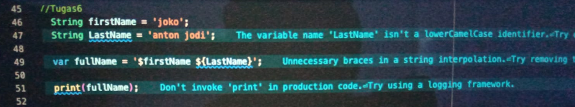

<b>Jawab:</b>

a. Kode Program

    void main() {
        // Tugas 6
        String firstName = "Elang";
        String lastName = "Putra Adam";

        var fullName = '$firstName ${lastName}';

        print(fullName);
    }

b. Hasil

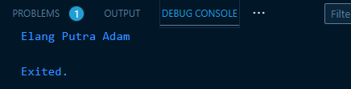

c. Penjelasan

Kode program diatas membuat dua buah variabel String dengan nama firstName (Elang) dan lastName (Putra Adam). Selanjutnya, dibuat sebuah variabel fullName yang memiliki isi gabungan dari firstName dan LastName sehingga saat diprint menampilkan hasil output "Elang Putra Adam" seperti pada gambar diatas.

> **_Note:_**  Tanda dolar ($) pada kode diatas digunakan untuk membaca nilai dari variabel yang ingin dipanggil ke dalam nilai dari variabel String (di dalam tanda petik).

<b>8. Tugas 7</b>

<b>Jawab:</b>

a. Kode Program

    void main() {
        // Tugas 7
        var text = 'ini \'OPTIMAL\` \$sekali';
        print(text);
    }

b. Hasil

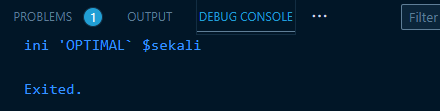

c. Penjelasan

Kode diatas membuat sebuah variabel text yang memiliki isi:

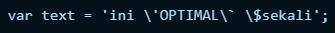

Pada kode tersebut, terdapat 3 buah backslash yang dimana backslash tersebut berguna untuk membuat tanda petik (') dan tanda dolar($) sebelum tanda petik penutup (setelah $sekali) menjadi terbaca dan tidak diidentifikasi sebagai tanda petik penutup sehingga dapat menghasilkan output seperti pada gambar diatas.

<b>9. Tugas 8</b>

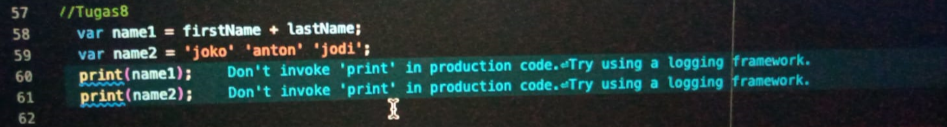

<b>Jawab:</b>

a. Kode Program

    void main() {
        // Tugas 8
        String firstName = "Elang";
        String lastName = "Putra Adam";

        var name1 = firstName + lastName;
        var name2 = 'Adam' 'Putra' 'Elang';
        print(name1);
        print(name2);
    }

b. Hasil

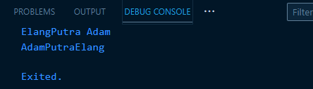

c. Penjelasan

Kode diatas membuat 2 buah variabel (name1 dan name2) yang dimana name1 adalah hasil dari penggabungan nilai firstName (Elang) dan lastName (Putra Adam) sehingga menghasilkan output "ElangPutra Adam" seperti pada gambar diatas. Untuk name2, memiliki nilai 'Adam' 'Putra' 'Elang' yang menghasilkan output "AdamPutraElang" tanpa spasi karena pada tiap akhir kata tidak diberikan spasi sehingga menghasilkan output seperti pada gambar diatas.

<b>10. Tugas 9</b>

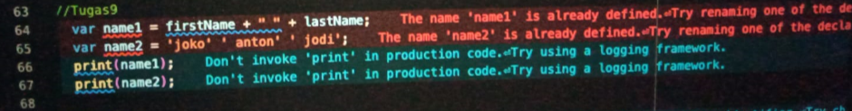

<b>Jawab:</b>

a. Kode Program

    void main() {
        // Tugas 9
        String firstName = "Elang";
        String lastName = "Putra Adam";

        var name1 = firstName + " " + lastName;
        var name2 = 'Adam' 'Putra' 'Elang';
        print(name1);
        print(name2);
    }

b. Hasil

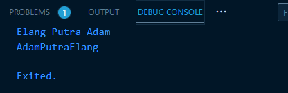

c. Penjelasan

Kode diatas hampir sama dengan tugas sebelumnya. Perbedaannya hanya ada pada bagian variable name1 yang ditambahkan dengan " " (spasi) sehingga menghasilkan output "Elang Putra Adam", berbeda dengan tugas nomor sebelumnya yang memiliki hasil "ElangPutra Adam". Untuk variabel name2 hasilnya tetap sama seperti pada tugas sebelumnya.

<b>11. Tugas 10</b>

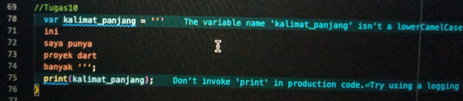

<b>Jawab:</b>

a. Kode Program 

    void main() {
        // Tugas 10
        var kalimat_panjang = '''
        ini
        saya punya
        proyek dart
        banyak ''';
        print(kalimat_panjang);
    }

b. Hasil

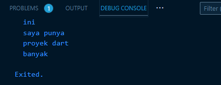

c. Penjelasan

Kode diatas membuat sebuah variabel dengan nama kalimat_panjang yang memiliki nilai multi-baris (terdapat beberapa enter/baris). Untuk dapat membuat sebuah kalimat multi-baris seperti pada kode program diatas, dibutuhkan tanda petik tiga/multi (''') sehingga kalimat multi-baris tersebut dapat terbaca. Jika tidak menggunakan tanda petik tiga/multi (''') maka akan menampilkan error karena selain tanda petik tiga/multi (''') tidak bisa membaca kalimat multi-baris.